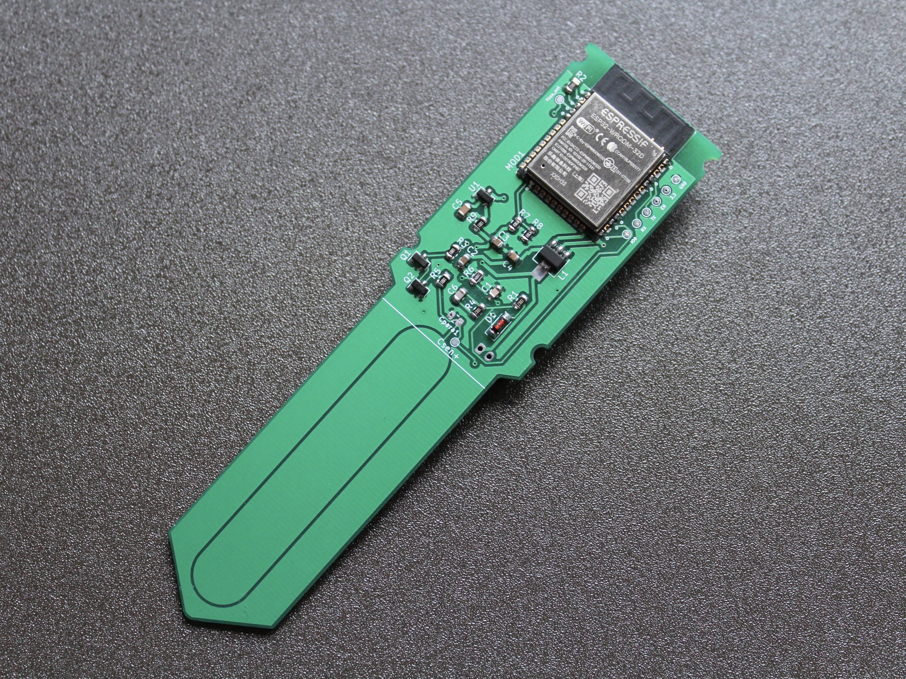
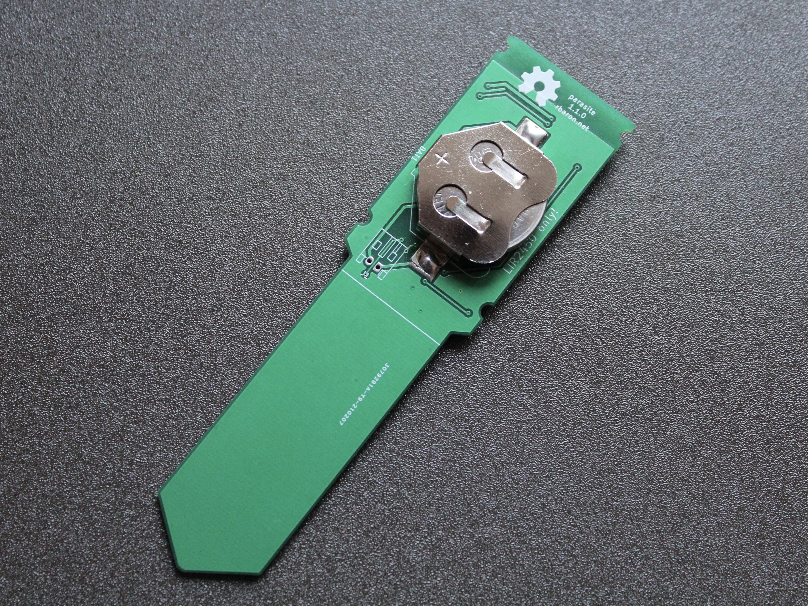
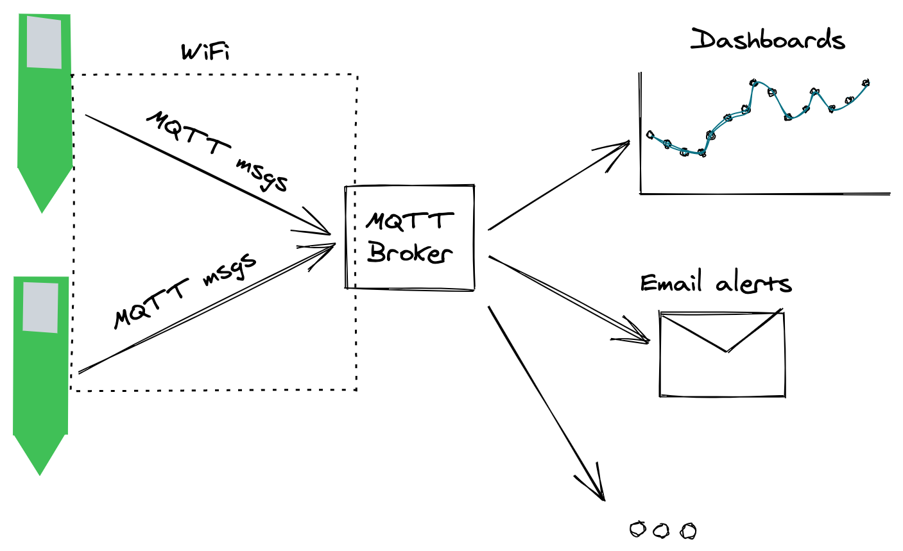

# w-parasite

w-parasite is an open source, WiFi-enabled soil moisture sensor for house plants.

This repo contains all the hardware design files (schematic, printed circuit board layout) and code for customizing and making your own w-parasite.

# How It Works

w-parasite works by reading the soil moisture level and transmitting that information via MQTT messages via WiFi. To save battery, the board sleeps most of the time, and only wakes up every few minutes, at which point it takes a reading and ships it to the MQTT broker.

An [ESP32](https://www.espressif.com/en/products/socs/esp32) sits at the heart of the board, and is responsible for managing the sensors and connecting to WiFi.

The board can be powered with LiPo/Li-Ion batteries. There is a battery clip for rechargeable LIR2450 batteries, as well as a possibility for soldering a JST connector for beefier LiPo/Li-Ion batteries.

# Battery Life
To estimate the battery life and discuss our choice of technologies, we can agree on a few premisses:
1. Soil moisture doesn't change abruptly (except when watered). It is okay to wait several minutes between readings.
2. Most of the time, the sensor will be in a low power mode ("deep sleep"), in which its CPU is not active and it's not connected to WiFi. The current consumption in this state can be brought to around 10uA (consumed mainly by the ESP32 and the voltage regulator - LDO);
3. When the sensor is active, its current consumption is orders of magniture higher. WiFi and ESP32 are not usually a good choice for low power devices, but since we can get away with such long periods of deep sleep, we might just barely get away with it. When active, w-parasite can consume up to 100-200mA. It is paramount that we keep the active time short - cutting it down from 4 to 2 seconds might just double the battery life!

We have two main choices for battery:
- LIR2450 Li-Ion coin cells. They are super compact (as in the photo above), but have only around 100mAh of energy in them.
- LiPo/Li-Ion cells. They are generally a lot bigger but can usually pack 500-3000mAh.

For a LIR2450 cell, w-parasite should be able to run for 100-150 days. For a beefier LiPo/Li-Ion cell, we can easily reach well over a year on a single charge.

# Why not Bluetooth Low Energy (BLE)?
Excellent question! With BLE, we can work with much lower currents, and we can power the board with even cheaper batteries like the ubiquitous CR2032. On the other hand, if we want to integrate the sensor with common open source home automation software, BLE requires another moving part: a bridge to pipe BLE messages to MQTT, making our infrastructure slightly more complex. It is an interesting tradeoff, and one I want to explore further.

# License
The hardware and associated design files are released under the [Creative Commons CC BY-SA 4.0 license](https://creativecommons.org/licenses/by-sa/4.0/).
The code is released under the [MIT license](https://opensource.org/licenses/MIT).